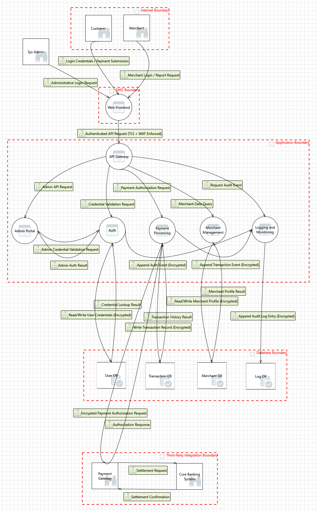

# Secure Architecture and Design Report
**Online Payment Processing Application (Option A)**

---

## Task 1 - System Definition and Architecture

### System Overview

The Online Payment Processing Application is an internet-facing web system enabling customers to make secure digital payments to merchants. It manages authentication, payment authorization, transaction storage, and administrative operations. Because it handles sensitive financial and personal data and integrates with third-party services, clearly defined trust boundaries are essential.

### Users and Roles

| Role | Responsibilities | Trust Level |
|------|-----------------|-------------|
| Customer | Registers, authenticates, initiates payments, views transaction history | Untrusted (Internet) |
| Merchant | Receives payments, accesses reports, manages profile | Semi-trusted (External) |
| System Administrator | Manages users, monitors logs, handles disputes, configures settings | Highly Privileged |
| Payment Gateway | Authorizes payment transactions | External Dependency |
| Core Banking System | Settles financial transactions | External Dependency |

### Application Components

**Frontend**
The Web Frontend is the sole internet-facing component, sitting in a DMZ. It handles login, payment submission, and dashboards for customers and merchants. The System Administrator accesses the system via a separate administrative login flow through this same frontend. All communication to the backend uses TLS with WAF enforcement.

**Backend Services**

- **API Gateway** - single entry point for all inbound requests; handles routing, validation, and audit event emission.
- **Authentication Service** - validates credentials for all roles; enforces MFA for admin access.
- **Payment Processing Service** - handles payment authorization and transaction recording; communicates with the external Payment Gateway.
- **Merchant Management Service** - manages merchant profiles and report access.
- **Admin Portal** - privileged portal operating within the Application Boundary; routes through the API Gateway and authenticates via the Authentication Service.
- **Logging and Monitoring Service** - receives audit events from the API Gateway, Authentication Service, and Payment Processing Service; writes encrypted entries to the Log Database.

**Data Storage**

- User Database
- Merchant Database
- Transaction Database
- Log/Audit Database

### Data Types Handled

User credentials, PII, payment card data, transaction records, merchant financial data, API keys and integration secrets, and system audit logs - all requiring confidentiality, integrity, and availability protection.

### External Dependencies

- **Payment Gateway** - transaction authorization
- **Core Banking System** - fund settlement

Both operate outside direct application control. All communication crosses the Third-Party Integration Boundary over encrypted channels.

### Trust Boundaries

1. **Internet Boundary** - separates external users (Customer, Merchant, Sys Admin) from the Web Frontend. All inbound traffic is untrusted. The Admin follows a separate login flow once past this boundary.
2. **DMZ (Public Tier)** - the Web Frontend resides here, the only component directly reachable from the internet.
3. **Application Boundary** - encompasses all backend services. All requests entering this zone must pass through the API Gateway. The Admin Portal operates as a privileged segment within this boundary with MFA-enforced access and dedicated audit logging.
4. **Database Boundary** - isolates data storage from backend services. No direct external database access permitted; all reads and writes are mediated by their respective services.
5. **Third-Party Integration Boundary** - separates internal services from the Payment Gateway and Core Banking System. Communication is encrypted and initiated exclusively by the Payment Processing Service.

### Architecture Diagram



---
## Task 2 - Asset Identification and Security Objectives

### Asset Identification

The Online Payment Processing Application handles multiple assets across authentication, financial processing, and administrative domains. These assets are classified based on their sensitivity and operational importance.

### Asset Inventory Table

| Asset ID | Asset Name | Description | Location/Component | Sensitivity Level | Security Objectives (CIA) |
|-----------|------------|-------------|-------------------|------------------|--------------------------|
| A1 | User Credentials | Hashed passwords, authentication tokens, MFA secrets | Authentication Service, User Database | Critical | Confidentiality, Integrity, Availability |
| A2 | Personal Data (PII) | Names, emails, contact information | User Database | High | Confidentiality, Integrity, Availability |
| A3 | Payment Card Data | Card number, expiry date, CVV (transmitted to gateway) | Payment Processing Service (transit) | Critical | Confidentiality, Integrity, Availability |
| A4 | Transaction Records | Payment amounts, timestamps, status, references | Transaction Database | Critical | Integrity, Availability |
| A5 | Merchant Financial Data | Merchant profiles, settlement data | Merchant Database | High | Confidentiality, Integrity, Availability |
| A6 | API Keys & Integration Secrets | Payment Gateway credentials, service-to-service secrets | Application Configuration | Critical | Confidentiality, Integrity, Availability |
| A7 | Audit Logs | Authentication logs, admin actions, transaction events | Log Database | High | Integrity, Availability |
| A8 | Business Logic | Payment validation rules, authorization workflows | Payment Processing Service | Critical | Integrity, Availability |
| A9 | Administrative Controls | Admin configurations, dispute management actions | Admin Portal | Critical | Integrity, Availability |
| A10 | System Infrastructure / Uptime | Platform uptime, service responsiveness | Entire System | Critical | Integrity, Availability |

### Security Objectives

The system must ensure the following security objectives for its assets:

- **Confidentiality** - Prevent unauthorized disclosure of sensitive data.  
- **Integrity** - Prevent unauthorized modification of data or business logic.  
- **Availability** - Ensure continuous system functionality and uptime.  

### Explanation of Security Priorities

- **User Credentials, API Keys, Payment Data** require high confidentiality and integrity, as compromise could lead to system takeover or financial fraud.  
- **Transaction Records, Business Logic, Administrative Controls** require strong integrity and availability to prevent fraud, maintain correct processing, and support operations.  
- **Audit Logs** focus on integrity and availability to ensure logs remain accurate and accessible.  
- **System Infrastructure / Uptime** emphasizes integrity and availability to prevent downtime and ensure reliable service.

---

## Task 3 - Threat Modeling (STRIDE)

### Methodology

Threats were identified using the **STRIDE** framework across all required areas: authentication, authorization, API communication, data storage, logging and monitoring, and administrative access. All threats in this system are rated **High** due to its internet exposure, high-value financial assets, and the cascading impact of any trust boundary violation.

### STRIDE Threat Table

| ID | Category | Threat | Affected Component | Impact |
|----|----------|--------|--------------------|--------|
| T-01 | Spoofing | Credential stuffing / brute-force attack to authenticate as a legitimate customer | Authentication Service | Account takeover, fraudulent transactions |
| T-02 | Spoofing | Merchant identity spoofing via stolen credentials, session hijacking, or token replay | Merchant Portal | Unauthorized access to financial data and payout reports |
| T-03 | Spoofing | Administrator compromise via phishing, MFA fatigue, or session token theft | Admin Portal | Full system control, configuration changes, data exposure |
| T-04 | Tampering | XSS injection to modify frontend behavior or steal active session tokens | Web Frontend | Session compromise, unauthorized actions under victim identity |
| T-05 | Tampering | Interception and modification of API request payloads between the Web Frontend and API Gateway | API Gateway | Altered transaction amounts or unauthorized operations |
| T-06 | Tampering | Manipulation of authorization or payment parameters before reaching Payment Processing | Payment Processing Service | Financial fraud, inconsistent transaction records |
| T-07 | Tampering | Tampering with data on the Append Audit Log Entry channel, corrupting the audit trail | Log Database | Destroyed forensic evidence, compliance failure |
| T-08 | Repudiation | API Gateway denies forwarding a transaction request, creating accountability gaps | API Gateway | Inability to reconstruct attack chains or resolve disputes |
| T-09 | Repudiation | Log DB denies receiving audit entries from the Logging Service | Log Database | Loss of tamper-evident records required for compliance |
| T-10 | Repudiation | Payment Processing denies receiving an authorization response from the Payment Gateway | Payment Processing Service | Unresolvable transaction disputes and chargeback fraud |
| T-11 | Information Disclosure | Sensitive customer data or tokens exposed on the Web Frontend–API Gateway data flow | API Gateway / Web Frontend | Credential theft, session hijacking, PII exposure |
| T-12 | Information Disclosure | Authentication credentials sniffed on the Credential Validation Request flow | Authentication Service | Account compromise, unauthorized access escalation |
| T-13 | Information Disclosure | Authorization response payload intercepted between Payment Gateway and Payment Processing | Payment Processing Service | Financial data leakage, replay attack enablement |
| T-14 | Information Disclosure | Audit log entries sniffed in transit on the Append Audit Log Entry flow | Logging Service / Log DB | Disclosure of system behavior patterns enabling targeted attacks |
| T-15 | Denial of Service | Web Frontend forced into a degraded or crashed state | Web Frontend | Customer-facing downtime, interrupted payment services |
| T-16 | Denial of Service | Credential Validation Request channel interrupted, blocking all authentication | Authentication Service | System-wide user lockout |
| T-17 | Denial of Service | Encrypted Payment Authorization Request flow to Payment Gateway interrupted | Payment Processing Service | Revenue loss, complete transaction processing failure |
| T-18 | Elevation of Privilege | Improper role validation exploited to escalate from customer to merchant role | Authorization Layer | Unauthorized access to merchant-level financial data |
| T-19 | Elevation of Privilege | Compromised internal service leverages excessive privileges for lateral movement | API Backend | Cross-service data compromise within the application boundary |
| T-20 | Elevation of Privilege | CSRF forces an authenticated user's browser to submit forged state-changing requests | Payment Processing Service | Unauthorized transactions under a legitimate user session |

### Risk Reasoning

All threats are rated **High** because the system: (1) processes high-value financial transactions over the public internet, (2) maintains concentrated authentication and administrative privileges, (3) faces privilege escalation paths that enable cascading cross-boundary compromise, and (4) handles data whose integrity violations directly translate to monetary and legal risk.

---

## Task 4 - Secure Architecture Design

### Updated Architecture (Logical View)

```
Internet
  ↓
[WAF]
  ↓
[Web Frontend - DMZ]
  ↓  (TLS enforced)
[API Gateway - rate limiting, auth, routing]
  ↓
[Private Application Subnet]
  ├── Authentication Service
  ├── Payment Processing Service
  ├── Merchant Management Service
  ├── Logging / Monitoring Service → [SIEM]
  └── Admin Portal (Management Subnet - VPN + MFA only)
  ↓
[Isolated Database Subnet - encrypted at rest]
  ├── User DB
  ├── Transaction DB
  ├── Merchant DB
  └── Log DB (append-only / immutable)

Separate Planes:
  - Secrets Manager (internal only, no internet access)
  - Isolated CI/CD Pipeline
```

### Security Controls

**Identity and Access Management**
Centralized authentication using OAuth2 / OIDC. MFA enforced for merchants and mandatory for all admin access. Role-Based Access Control (RBAC) with least privilege enforcement and short-lived access tokens. Separating authentication logic from application services improves auditability and prevents spoofing (mitigates T-01 through T-03, T-18 through T-20).

**Network Segmentation**
Web Frontend in a DMZ; backend services in a private subnet with no direct internet access; databases in an isolated subnet; Admin Portal accessible only via a dedicated management network over VPN. Limits lateral movement - if one layer is compromised, the attacker cannot directly reach critical services (mitigates T-15 through T-19).

**Data Protection**
TLS on all traffic (in transit). AES-256 encryption at rest for all databases. Passwords hashed with bcrypt/Argon2. Payment card data tokenized at ingress and never stored in plaintext. Field-level encryption applied to sensitive transaction records. Reduces impact of any database breach (mitigates T-11 through T-14).

**Secrets Management**
Centralized secrets manager with no hard-coded credentials anywhere in the codebase. Automatic secret rotation and environment-based isolation. Prevents credential leakage and limits persistence after a compromise (mitigates T-06, T-13).

**Monitoring and Logging**
Centralized logging service feeding a SIEM with real-time alerting. Audit logs are append-only and immutable (write-once storage or cryptographic chaining). Admin activity monitoring and anomaly detection on failed logins. Detects attacks early and prevents repudiation (mitigates T-07 through T-10, T-14).

**Secure Deployment**
Isolated CI/CD pipeline with SAST/DAST scanning at every stage. Signed container images. Infrastructure as Code (IaC) for reproducible, auditable deployments. Separate dev, staging, and production environments. Reduces supply chain risk and prevents insecure deployments.

### Defense-in-Depth Summary

No single control is relied upon alone. Security is applied in layers: WAF filters malicious traffic → API Gateway enforces authentication and rate limits → RBAC restricts internal access → network segmentation limits blast radius → encryption protects data at rest and in transit → immutable logging ensures accountability.

---

## Task 5 - Risk Treatment and Residual Risk

### Risk Treatment Decisions

| Threat Category | Treatment | Rationale |
|----------------|-----------|-----------|
| Credential Spoofing (T-01 to T-03) | Mitigate | MFA, rate limiting, strong centralized authentication |
| XSS / Frontend Tampering (T-04) | Mitigate | WAF, Content Security Policy, input sanitization |
| API / Payload Tampering (T-05, T-06) | Mitigate | TLS, request signing, input validation, integrity checks |
| Repudiation (T-08 to T-10) | Mitigate | Immutable audit logs with cryptographic chaining |
| Information Disclosure (T-11 to T-14) | Mitigate | TLS, encryption at rest, tokenization, access controls |
| Denial of Service (T-15 to T-17) | Mitigate | WAF, rate limiting, load balancing, redundant infrastructure |
| Privilege Escalation (T-18 to T-20) | Mitigate | RBAC, least privilege, CSRF tokens, session controls |
| Third-Party Payment Risk | Transfer | Certified external PCI-DSS compliant payment provider; contractual SLAs |
| Zero-Day Vulnerabilities | Accept | Cannot be eliminated; managed via continuous patching and SIEM monitoring |
| Advanced Insider Threats | Accept | Partially mitigated via RBAC and monitoring; residual human risk acknowledged |

### Residual Risk

Residual risk remains because no system achieves perfect security. Human factors - phishing, social engineering, insider threats - cannot be fully eliminated by technical controls. Zero-day vulnerabilities may bypass existing defenses before patches are available. The distributed nature of the system inherently increases the attack surface.

These accepted risks are managed through: continuous SIEM monitoring, incident response planning, periodic penetration testing, and contractual risk transfer for third-party payment processing. Layered controls significantly reduce both the likelihood and impact of residual risk scenarios.

---

## Task 6 - Final Summary

### Assumptions and Limitations

This design makes a few important assumptions worth stating clearly:

- **No specific cloud provider is required.** The architecture is designed to work on any standard infrastructure - AWS, Azure, on-premise, or otherwise. No vendor lock-in is assumed.
- **Customers and merchants connect over the public internet.** There is no private network or VPN requirement for end users - the system must be accessible to anyone with a browser.
- **Technology alone cannot stop insider threats.** If a trusted employee decides to misuse their access, no firewall or encryption will fully prevent it. Hiring practices, background checks, and internal policies are assumed to exist alongside this architecture, but are outside its scope.
- **Third-party providers are trusted to handle their own security.** The Payment Gateway and Core Banking System are assumed to be PCI-DSS certified. We have no visibility into or control over how they secure their own systems - we can only secure what crosses the boundary into ours.

### Conclusion

This report has walked through the full security design of an online payment processing system - from defining what the system does and who uses it, to identifying what needs protecting, to analyzing how it could be attacked, to proposing concrete defenses.

Using the STRIDE framework, 20 distinct threats were identified across every layer of the system - from the login screen all the way down to the audit logs and third-party payment connections. All of them were rated High risk, because in a financial system, even a small breach can mean real money lost, real customer data exposed, and real legal consequences.

The architecture responds to these threats in layers: a WAF and API Gateway at the edge, strong authentication and role-based access inside, encrypted storage at the bottom, and continuous monitoring throughout. No single control is expected to hold on its own - the design assumes some controls will fail and compensates accordingly.

Some risk remains. Zero-day vulnerabilities, sophisticated insider attacks, and failures at third-party providers cannot be fully engineered away. These are accepted knowingly, with monitoring and incident response plans in place to detect and contain them when they occur.
